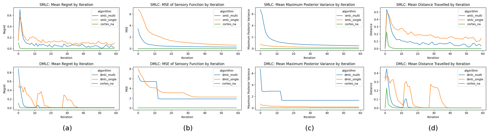

# multifidelity-learning-coverage

A repository of the multifidelity learning and coverage algorithms for multi-robot systems presented in the [2021 IEEE CCTA](https://ccta2021.ieeecss.org/) submission ["Online Estimation and Coverage Control with Heterogeneous Sensing Information"](assets/mcdonald_ccta21_preprint.pdf) by Andrew McDonald, Lai Wei and Vaibhav Srivastava.

# Abstract

Why are we interested in the problem of multifidelity learning and coverage for multi-robot systems?

> Heterogeneous multi-robot sensing systems are often able to characterize physical processes—such as pollution events or wildfires—more comprehensively than homogeneous systems. Access to multiple modalities of sensory data allows heterogeneous systems to fuse information from different sources and ultimately learn a richer representation of the process of interest. These data typically consist of multiple correlated levels of fidelity ranging in accuracy (bias) and precision (noise). Low-fidelity data may be more plentiful, while high-fidelity data may be more trustworthy. In this paper, we draw inspiration from techniques originating in the field of multi-fidelity modeling and apply them to the problem of multi-robot online estimation and coverage control, using a combination of low-fidelity and high-fidelity data to learn and cover a sensory function of interest. Specifically, we leverage multi-fidelity Gaussian Process regression to (i) fuse heterogeneous sensory data and learn an unknown sensory function while (ii) simultaneously performing coverage on the inferred function. We propose two algorithms for this task of heterogeneous learning and coverage—namely Stochastic-sequencing of Multi-fidelity Learning and Coverage (SMLC) and Deterministic-sequencing of Multi-fidelity Learning and Coverage (DMLC)—and prove they converge asymptotically. In addition, we demonstrate the empirical efficacy of SMLC and DMLC through numerical simulations.

See the rest of our [paper](assets/mcdonald_ccta21_preprint.pdf) for more.

# Key Results

Given a mix of low- and high-fidelity data, our simulations show that implementations of SMLC and DMLC (joint learning and coverage algorithms we propose in our [paper](assets/mcdonald_ccta21_preprint.pdf)) using multifidelity learning models outperform their single-fidelity counterparts, as quantified by coverage regret (panel a) and mean squared error in the estimate of an unknown sensory function (panel b). Further, multifidelity implementations preserved more realistic uncertainty in the estimate of the unknown sensory function (panel c) and led agents to travel shorter distances on average (panel d). 

Blue lines correspond to implementations of SMLC and DMLC which estimate an unknown sensory function using a multifidelity model, while orange lines correspond to implementations using a single-fidelity model. Green lines correspond to the baseline coverage algorithm of Cortes et. al. which assumes perfect knowledge of the sensory function and is expected to outperform algorithms which must learn the sensory function.

See the rest of our [paper](assets/mcdonald_ccta21_preprint.pdf) for more.

# Video

A video demonstrating our multifidelity learning and coverage algorithms is under development and will be posted to YouTube in the near future.

# Code

#### Structure

- `assets/` -
- `data/` -
- `images/` -
- `logs/` -
- `plots/` -
- `src/` -

#### Reproducing Results

1. Install `numpy`, `scipy`, `pandas`, `matplotlib`, `autograd`, `sklearn` and `mlrose` using `pip` or `conda`.
1. Clone this repository with `git clone https://github.com/andrewmcdonald27/multifidelity-learning-coverage.git`
1. Open a command prompt (or IDE of your choice) in the `src` directory of the cloned repository
1. From the `src` directory, run `python driver.py`
1. This will save output to the `logs` directory in a `config` and `csv` file. The `config` file is merely a copy of the config file used to run the experiment, while the `csv` file contains the results of the simulation
1. Edit the `name` variable just below `if __name__ == "__main__":` in  `analysis.py` to be the name of files created in your `logs` directory from the most recent experimental run
1. From the `src` directory, run `python analysis.py`
1. This will create and save visualizations of key performance metrics to the `plots` directory, recreating the plots shown in the figure above.

# Citation

We hope you find this repository helpful, and encourage you to extend and adapt our code in your multi-robot research endeavors. If you use the code in this repository, please cite our paper as below.

#### IEEE

A. McDonald, L. Wei, and V. Srivastava, "Online Estimation and Coverage Control with Heterogeneous Sensing Information" in Proceedings of the IEEE Conference on Control Technology and Applications. Under Review. San Diego, CA: IEEE, 2021.

#### BibTeX
    @InProceedings{McDonald2021,
        address = {Under Review. San Diego, CA},
        author = {McDonald, Andrew and Wei, Lai and Srivastava, Vaibhav},
        booktitle = {Proceedings of the IEEE Conference on Control Technology and Applications},
        publisher = {IEEE},
        title = {Online Estimation and Coverage Control with Heterogeneous Sensing Information},
        year = {2021}
    }

# Contact

Please reach out to Andrew McDonald at [mcdon499@msu.edu](mcdon499@msu.edu) with any questions, comments, or concerns.
